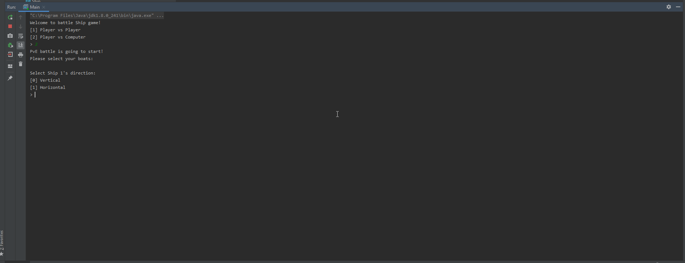

# Battle-Ship-Game
I’ve implemented everyone’s favorite Battle Ship Game in Java for my Advanced Programming course. The game supports both single-player and local multiplayer modes and is console-based.

Here’s some gameplay footage: (Click to open in full size on a new tab)

